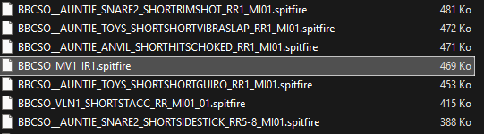

# Spitfire Audio BBC Symphony Orchestra MV1 impulse response reconstruction

## Introduction

The BBC SO instrument library by Spitfire Audio features instruments with natural reverberation baked in the samples.
It also features an extra reverberation convolution effect which can be added on top.

This convolution reverberation is generated thanks to an impulse response (IR) recorded in Maida Vale 1 Hall (MV1),
which is very likely the same hall as the one used to record the instrument samples.

In order to better integrate other instruments with the BBC SO library,
it would be a good thing to dispose of this IR so similar sounding acoustics can be approximated.

Alas, this IR is in a proprietary format which is not exploitable by other convolution effects.

This document describes a simple method to reconstruct an IR by approximating a frequency sweep then by using
deconvolution.

I am using the BBC SO "Core" edition as an example because this is the licence I own.
But I do think the very same method is probably applicable to the free "Discover" edition.

## Content of the directory

* "BBC_SO_MV1_IR_w001.rpp" is the Reaper 7 project I created to produce all the example audio files.
  But you can probably do the exact same thing with any other DAW using the method described in this document.

### V1

* "Sweep.wav" is a frequency sweep simulated with the BBC SO flute long articulation played "dry" (default setting)
  This sample is used as a reference tone when deconvolving
* "Sweep Reverb.wav" is the same sweep played "wet" (reverberation at 100%)
  This sample is the signal to be deconvolved by the reference tone

Examples of reconstructed IRs are also provided :

* "BBC_SO_MV1_IR.wav" : Direct result of the deconvolution
* "BBC_SO_MV1_IR_comp.flac" : Reconstructed IR with compensated gain

These files are directly usable if you don't want to bother with all this process.

## Method

### Sequencing of the required samples for deconvolution

I created 2 tracks with one instance of the BBC SO solo flute for each.

I am using the flute because it is the instrument which is the closest to a sine wave and gives the best results to me.
However, I was also able to get similar, coherent and almost as good results with the solo violin, so feel free to
experiment and improve on this.

* The "Sweep" track is the solo flute long played dry (reverb at 0%) with disabled vibrato for good measure.

I am playing notes from C4 to C7 with 6 semitones between the notes, I am using the full range of the instrument.

If you think playing overlapping notes or frequencies is "wrong", watch this video :
[Air Reverb - Behind the Scenes with Spitfire Audio!](https://youtu.be/syksivikDB8?t=440)

This was enlightening to me and I found that this improves the results considerably.

I am using CC11 (Expression) to approximate a Tukey window. This is to eliminate any potential pop or noise at the
beginning and at the end.

Flute FX settings with vibrato disabled and reverb at 0%

Here, I am using a LFO to control the global tune which is the whole trick to get a sweep from any instrument.

I am using the full range of this knob which is -36 to +36 semitones.

The 8.000 quarter notes "saw R" LFO at 60 bpm makes a 8 seconds sweep.

This gives a linear and not a logarithmic sweep but, it works just fine.
IR deconvolution is a much more tolerant process that you might think.

* The "Sweep Reverb" track is a basically a duplicate track where I only set the reverb at 100%
  (In Reaper, I am sending the MIDI, so I am sure this is playing exactly the same thing)

Then from Reaper, I rendered "Sweep" and "Sweep Reverb" using the region matrix to "Sweep.wav" and "Sweep Reverb.wav".

From a 8 seconds sweep, I render 11 seconds because I estimated that the reverberation was no longer than 3 seconds.

The project sampling rate is 48 Khz.
By trying with 96 Khz, I found that the original IR used in BBC SO is very likely not more than 48 Khz since
I only get aliasing with frequency reflection typical of a resampling algorithm, but feel free to verify this and do
tell me what you think.

* The last track "Sweep ReaVerb" is just an audio send from the first track "Sweep" with an instance of "ReaVerb" which
  is the built-in convolution effect of Reaper.
  This is used to test the resulting deconvolved IR and verify that it is 'close enough' from the desired outcome.

### V2

After noticing the BBC SO reverb knob is NOT a dry / wet mix but a reverb mix only instead, I modified the setup
to subtract "Sweep" from "Sweep Reverb".
This is likely more correct even if the result seems only marginally different.

* "BBC_SO_MV1_IR_V2_w001.rpp" : Reaper 7 project to produce all the V2 example audio files

* "Sweep_V2.wav" : frequency sweep from Reaper project V2
* "Sweep Reverb_V2.wav" : "wet" sweep from Reaper project V2 ("Sweep" subtracted by phase inversion)

* "BBC_SO_MV1_IR_V2_comp+12dB.flac" : Reconstructed IR V2 with compensated gain and finally amplified by +12dB

### Deconvolution

Finally, I deconvolve "Sweep Reverb.wav" using "Sweep.wav" as a reference tone.

I used my own tool IR Tool which is available for free on my github right here :

[IR Tool, python sources and info](https://github.com/robotmitchum/ir_tool)

[IR Tool v1.1.3 windows x64 executable](https://github.com/robotmitchum/ir_tool/releases/tag/v1.1.3)

But you can use any other tool to do the very same process, Reaper has a builtin deconvolution tool for example.

## Conclusion

Resulting IR seems to exhibit a non-negligible pre-delay (about 62 ms).
This seems coherent with the effect result within the BBC SO plugin though.